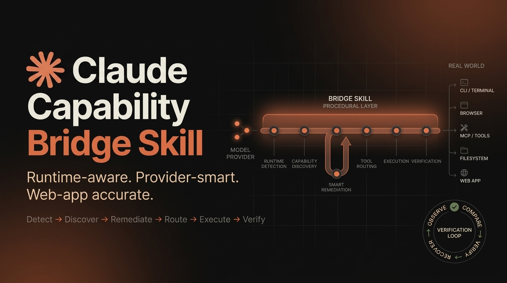

<div align="center">

# Claude Capability Bridge Skill

### A procedural operating layer for custom-provider and third-party models using real agentic capabilities.

<p>
  
</p>

[](./SKILL.md)
[](./.github/workflows/validate.yml)
[](./LICENSE)

**Detect → Discover → Remediate → Route → Execute → Verify → Recover**

</div>

---

## The problem

Models can have access to the same browser, filesystem, shell, MCP tools, connectors, and other runtime capabilities as a strong native agent and still use them badly.

The missing layer is often procedural knowledge: identify the real host and execution boundary, inspect what is actually exposed and permitted, choose the right interface, preserve state, recover from failures, and gather enough evidence to say *done*.

> **Core invariant:** capability exposed ≠ capability understood ≠ task completed ≠ task verified.

This Skill turns that discipline into reusable procedures for Claude Code, Claude Desktop/Cowork-style hosts, and other Agent Skills-compatible runtimes.

## Runtime-first architecture

Before using a capability, establish the minimum operating profile needed for the task:

```text
HOST: CLI / Desktop / Cowork / Cloud / Remote / Other
EXECUTION: local / cloud / remote / mixed
PROVIDER: first-party / third-party / unknown
CAPABILITIES: shell / files / Git / browser / Chrome / MCP / GUI / etc.
             ↓
       discover relevant capability
             ↓
       classify what is missing
             ↓
       repair only when justified
             ↓
       route → execute → verify
```

CLI is a first-class host profile rather than a Desktop variant. Browser/Chrome availability is checked separately from shell or project execution, and provider restrictions remain a separate axis.

See [`references/runtime-detection-and-profiles.md`](./references/runtime-detection-and-profiles.md), [`references/claude-code-cli-operating-model.md`](./references/claude-code-cli-operating-model.md), and [`references/capability-remediation.md`](./references/capability-remediation.md).

## Before vs After

| Without the bridge | With the bridge |
|---|---|
| May assume the wrong host or execution location | Detects runtime and execution boundary first |
| May see tools without knowing when to use them | Discovers the live capability surface relevant to the task |
| Can choose a plausible but wrong tool | Selects the narrowest authoritative surface |
| May stop at “not connected” | Classifies the missing capability and attempts justified remediation |
| May invent arguments or rely on stale assumptions | Reads current contracts and invalidates stale observations |
| May confuse a running process with a working app | Verifies readiness, rendered state, and critical behavior |
| May claim success from partial evidence | Reports verified, blocked, failed, and unknown states separately |

<p align="center">
  
</p>

> This is an intended-behavior comparison, not measured benchmark data.

## How it works

```text
1. Runtime detection
2. Execution and provider profile
3. Capability discovery and safe probing
4. Missing-capability classification and remediation
5. Authoritative tool or surface selection
6. Short observable execution loops
7. Direct verification
8. Recovery or fallback
9. Evidence-backed report
```

The main `SKILL.md` is the stable kernel. Task-specific procedures are progressively loaded from `cards/`, `profiles/`, and `references/` only when the task needs them.

## Custom-provider support

A custom endpoint or gateway can be transport-compatible without making the underlying model behaviorally equivalent to an Anthropic model.

| Layer | Question |
|---|---|
| Model | Can it reason, use the required modalities, and emit reliable tool calls? |
| Skill | Does it have the procedural knowledge required by the workflow? |
| Runtime | Are tools, context, permissions, and dispatch exposed? |
| Transport / provider | Does the gateway preserve the protocol features the task needs? |
| Environment | Do files, processes, browser state, network, and services actually exist? |

<p align="center">
  
</p>

The bridge separates provider/runtime limits from procedural failures. A provider-unsupported browser integration should not trigger endless local setup attempts.

## Web-app verification

When an agent builds or repairs a web app, process success is not enough:

```text
project recognition
   ↓
launch contract
   ↓
process running
   ↓
port listening / HTTP ready
   ↓
browser surface selected
   ↓
critical user journey exercised
   ↓
feature behavior verified
```

```text
process running ≠ server ready ≠ page correct ≠ feature works
```

A server-side template opened with `file://` is not equivalent to running the application.

<p align="center">
  
</p>

## Capability coverage

| Area | What the bridge teaches |
|---|---|
| Runtime detection | Host, execution, and provider profiling |
| Browser and Chrome | Surface selection, localhost testing, context separation |
| Capability remediation | Classify → repair → re-probe → fallback |
| Computer use | GUI escalation and short observable action loops |
| MCP and connectors | Schema-first calls, mutation/read-back, trust boundaries |
| Projects and files | Project knowledge vs live filesystem vs Git state |
| Shell and code | Deterministic commands, servers, tests, readiness |
| Skills and plugins | Progressive disclosure, host controls, invocation boundaries |
| Artifacts and interactive apps | Creation vs rendered and behavioral verification |
| Delegation and long-running work | Bounded delegation and context isolation |
| Scheduled and remote work | Fresh execution context and local/cloud boundaries |
| Security | Permissions, authorization, prompt-injection resistance, least privilege |
| Evidence and recovery | Direct proof, failure classification, bounded retries |

## Adaptive delivery

A portable Skill cannot universally force its own invocation. For Claude Code, this repository includes an optional hook engine that adds context only when it is useful instead of repeating a reminder every turn.

| Event | Adaptive behaviour |
|---|---|
| `SessionStart` | Emit the compact kernel once per session, plus the card catalogue |
| `SessionStart` after compact | Rehydrate the minimum protocol and mark earlier observations stale |
| `UserPromptSubmit` | Usually emit nothing; inject at most one matching capability card |
| `PostToolUseFailure` | Classify the failure and emit bounded next-step guidance |

Modes are selected with `CLAUDE_CAPABILITY_BRIDGE_MODE`:

```text
adaptive (default) | session-only | legacy-every-turn | off
```

The legacy mode exists for A/B comparison with the pre-0.9.0 always-on reminder. Hook delivery is best-effort: the hook cannot prove that the host inserted its text, so downstream logic must not assume the model saw it.

See [`bootstrap/`](./bootstrap/), [`references/claude-code-bootstrap-kit.md`](./references/claude-code-bootstrap-kit.md), and [`docs/cache-contract.md`](./docs/cache-contract.md).

## Evaluation and benchmarking

The repository deliberately does not claim that the Skill improves every model. That should be demonstrated with controlled runs.

For forgetting, runtime-first behavior, and delivery cost, compare:

```text
A  control                    no Skill, no hooks
B  skill only                 Skill installed, hooks not registered
C  skill + adaptive           shipped default
D  skill + legacy-every-turn pre-0.9.0 reminder
```

Keep model, host, tools, provider config, workspace, task wording, and success criteria constant. Grade the trajectory and final state separately, and report cost per verified success alongside the raw counts. Cold and warm sessions are separate experiments.

Useful metrics include runtime identification before host-specific routing, tool-selection accuracy, schema-valid call rate, recovery quality, verification depth, false-success rate, unnecessary retries, and authorization or safety failures.

See [`benchmarks/README.md`](./benchmarks/README.md), [`benchmarks/behavioral-benchmark.md`](./benchmarks/behavioral-benchmark.md), and [`evals/evals.json`](./evals/evals.json).

> **No fake percentages:** until paired live runs exist, improvement is an engineering hypothesis, not experimental data.

## Installation

### Agent Skill

```bash
python3 scripts/package_skill.py
```

This produces `dist/claude-capability-bridge/`. Install that generated directory with the host's Agent Skills mechanism.

### Claude Code plugin

```bash
python3 scripts/package_claude_code_plugin.py
```

This produces `dist/claude-capability-bridge-plugin/`, bundling the same Skill payload with the optional hook runtime.

### Plain Skill hook registration

Copy the entries from [`bootstrap/settings.json.example`](./bootstrap/settings.json.example) into your settings and choose a mode with `CLAUDE_CAPABILITY_BRIDGE_MODE`. The plugin registers its own hooks.

Rollback is simple: set the mode to `off`, remove the hook entries, or delete the installed package. Session state lives in one per-user state directory and can be deleted to reset the next session to cold state.

## Repository structure

```text
claude-capability-bridge-skill/
├── SKILL.md                   # stable kernel
├── profiles/                  # host contracts
├── cards/                     # task-family procedures + generated index
├── references/                # long-form background and troubleshooting
├── bootstrap/                 # hook engine and host registration examples
├── config/                    # content budgets
├── docs/                      # cache contract and migration notes
├── scripts/                   # packagers, validator, card index, trace tools
├── tests/python/              # offline test suite
├── benchmarks/                # scenarios, variants, metrics, fixtures
├── evals/
├── assets/
├── i18n/
├── CHANGELOG.md
└── LICENSE
```

The project follows progressive disclosure:

```text
kernel → runtime profile → task card → reference → execution → verification
```

## Design boundaries

### The Skill can teach

`runtime awareness` · `capability discovery` · `tool routing` · `schema discipline` · `workflow sequencing` · `state tracking` · `verification` · `recovery` · `security boundaries` · `evidence-based reporting`

### The Skill cannot create

`browser runtime` · `computer-use runtime` · `MCP server` · `filesystem mount` · `network access` · `permissions` · `provider protocol compatibility` · `missing model capabilities` · `host hook registration`

That boundary is part of the design, not a disclaimer added after the fact.

## Validation

Run the offline checks locally:

```bash
python3 -m pip install -r requirements-dev.txt
python3 scripts/validate_skill.py
python3 scripts/run_tests.py
python3 bootstrap/bridge_hook.py --selftest
python3 scripts/analyze_trace.py --selftest
```

These checks cover packaging and reference closure, content contracts, hook behavior, state lifecycle and recovery, safety invariants, and shipped-text stability.

They do **not** prove live model behavior, real Claude Code execution, Windows support, or provider cache behavior. The live behavioral benchmark is intentionally not reported as passing by CI.

For strict Agent Skills conformance, validate the generated package with the official `skills-ref` validator when available.

## Documentation map

| Document | Purpose |
|---|---|
| [`SKILL.md`](./SKILL.md) | Stable runtime-first procedural kernel |
| [`Runtime detection`](./references/runtime-detection-and-profiles.md) | Host, execution, and provider profiling |
| [`CLI operating model`](./references/claude-code-cli-operating-model.md) | CLI-first routing and browser/provider boundaries |
| [`Bootstrap kit`](./references/claude-code-bootstrap-kit.md) | Adaptive Claude Code delivery and hook setup |
| [`Capability remediation`](./references/capability-remediation.md) | Diagnose and repair missing integrations |
| [`Custom Provider`](./references/custom-provider-transport.md) | Endpoint, gateway, and provider boundaries |
| [`Web App Verification`](./references/webapp-verification.md) | End-to-end web-app verification |
| [`Browser Workflows`](./references/browser-workflows.md) | Browser and Chrome procedures |
| [`MCP & Connectors`](./references/mcp-and-connectors.md) | Structured integration workflows |
| [`Evaluation`](./references/evaluation-and-attribution.md) | Controlled behavioral attribution |
| [`Cache contract`](./docs/cache-contract.md) | Ownership of cache-related behavior and claims |
| [`Migration`](./references/MIGRATION.md) | Where the 0.8.0 rules moved |
| [`Changelog`](./CHANGELOG.md) | 0.9.0 changes and upgrade notes |
| [`Windows checklist`](./tests/windows-manual-checklist.md) | Manual verification scope for PowerShell wrappers |

## Language versions

| Language | README |
|---|---|
| English | [`README.md`](./README.md) |
| 简体中文 | [`README_ZH.md`](./i18n/README_ZH.md) |
| Español | [`README_ES.md`](./i18n/README_ES.md) |
| हिन्दी | [`README_HI.md`](./i18n/README_HI.md) |
| العربية | [`README_AR.md`](./i18n/README_AR.md) |
| Français | [`README_FR.md`](./i18n/README_FR.md) |
| فارسی | [`README_FA.md`](./i18n/README_FA.md) |

## Support the project

If this project saves you time or helps you ship reliable agentic workflows, you can support its maintenance and future development.

- [GitHub Sponsors](https://github.com/sponsors/Abolfazlshahi)
- [Telegram](https://t.me/pythash) for project updates and direct contact

Small support helps fund maintenance, testing, documentation, and continued work on the bridge.

## License

Claude Capability Bridge Skill is released under the **[MIT License](./LICENSE)**.

<div align="center">

[GitHub](https://github.com/Abolfazlshahi/claude-capability-bridge-skill) · [Issues](https://github.com/Abolfazlshahi/claude-capability-bridge-skill/issues) · [Discussions](https://github.com/Abolfazlshahi/claude-capability-bridge-skill/discussions) · [Telegram](https://t.me/pythash) · [MIT License](./LICENSE)

</div>
