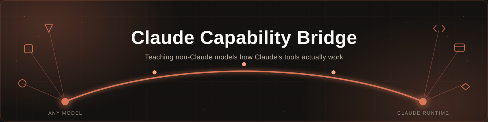
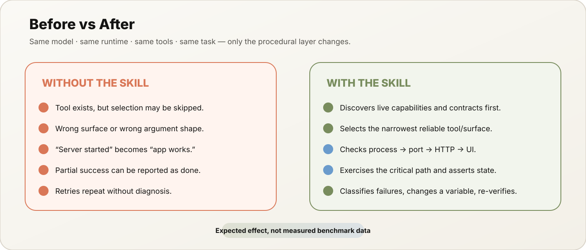
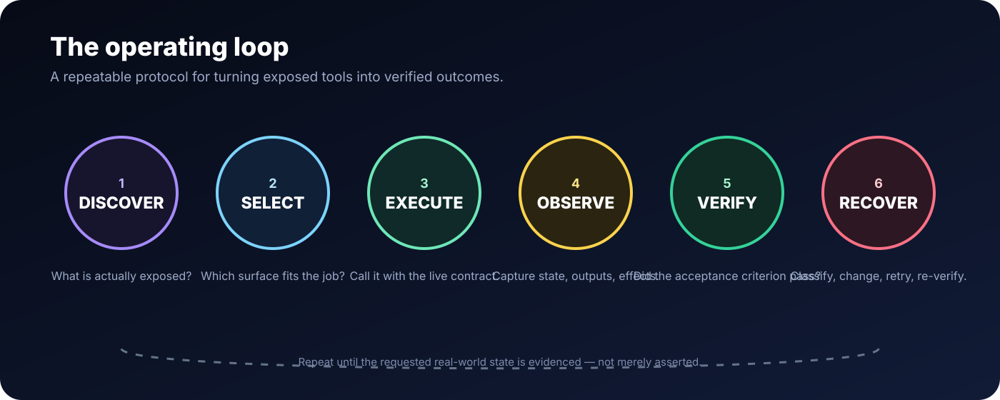
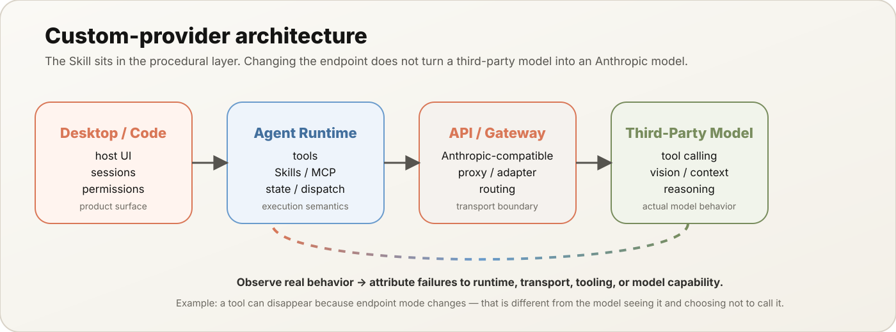
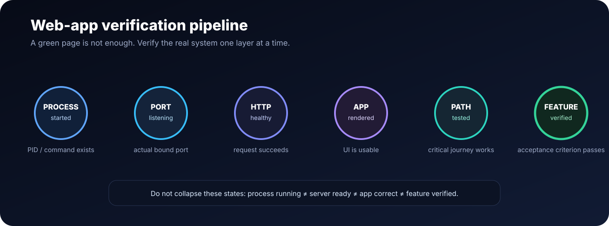

<div align="center">

# Claude Capability Bridge Skill

### Teach custom-provider models the **workflow knowledge** needed to operate agentic tools reliably.

<p>
  
</p>

[](./SKILL.md)
[](./.github/workflows/validate.yml)
[](./LICENSE)

**Discover → Select → Execute → Observe → Verify → Recover**

</div>

---

## 💖 Support the project

Financial support is optional and helps with continued development.

The wallet addresses below are taken from the author's [Chat-management-bot-and-AI-assistant](https://github.com/Abolfazlshahi/Chat-management-bot-and-AI-assistant) repository.

| Network | Address |
|---|---|
| **TON** | `UQDfjVk2UdpiMg-bsxqoLa0O_icuaF20D-wWJgIJwK1Ha2Ul` |
| **USDT — TRC20** | `TR8ibZGKutPKoDm5nMbHFwGPFBuMKwjG6j` |
| **USDT — BEP20** | `0x8c45d6bae8a5a572b2a776779fe0bcae3d3f9107` |

<p align="center">
  <a href="https://nowpayments.io/donation?api_key=724be14f-9bdf-4318-99d0-0a837b5493b6" target="_blank" rel="noreferrer noopener">
    
  </a>
</p>

---

## 🌍 Language

**English** · [中文](./i18n/README_ZH.md) · [Español](./i18n/README_ES.md) · [हिन्दी](./i18n/README_HI.md) · [العربية](./i18n/README_AR.md) · [Français](./i18n/README_FR.md) · [فارسی](./i18n/README_FA.md)

Seven localized README versions are maintained for the project.

---

## 🎯 What problem does this solve?

A model can have access to the same browser, filesystem, shell, MCP tools, connectors, and other runtime capabilities as a strong native agent and still use them poorly.

The missing piece is often **procedural knowledge**: knowing which surface to choose, how to sequence calls, how to preserve state, how to diagnose failure, and what evidence is sufficient to say *done*.

This Skill turns those behaviors into reusable procedures for Claude Desktop/Cowork-like and Claude Code-style Agent Skills runtimes.

> **Core invariant:** capability exposed ≠ capability understood ≠ task completed ≠ task verified.

---

## 🧠 Before vs After

| Without the bridge | With the bridge |
|---|---|
| May see tools without knowing when to use them | Discovers the live capability surface first |
| Can choose a plausible but wrong tool | Selects the narrowest reliable surface for the task |
| May invent arguments or rely on stale assumptions | Reads the current tool contract before unfamiliar calls |
| May stop after a process starts or a page loads | Verifies the actual acceptance criterion |
| May repeat the same failed call | Classifies the failure and changes a material variable |
| May confuse runtime, gateway, and model failures | Attributes failures to the correct layer |
| May claim success from partial evidence | Reports verified, blocked, failed, and unknown states separately |

<p align="center">
  
</p>

> **Honesty note:** this table describes the intended behavioral effect. It is **not** a measured benchmark result. See the evaluation section before making performance claims.

---

## ⚙️ How it works

<p align="center">
  
</p>

```text
Runtime discovery
      ↓
Capability + permission check
      ↓
Tool / surface selection
      ↓
Live schema inspection
      ↓
ACT → OBSERVE → DECIDE
      ↓
Acceptance verification
      ↓
Recovery or escalation
      ↓
Evidence-backed report
```

The main `SKILL.md` stays compact. Detailed procedures are progressively loaded from [`references/`](./references/) only when a task crosses into that capability family.

---

## 🔌 Custom-provider support

This is the part closest to the original motivation of the project.

<p align="center">
  
</p>

A custom endpoint or gateway can make an application **transport-compatible** without making the underlying model **behaviorally equivalent** to an Anthropic model.

| Layer | Question |
|---|---|
| **Model** | Can the model reason, use vision where needed, and emit reliable tool calls? |
| **Skill** | Does it have the procedural knowledge required by the workflow? |
| **Runtime** | Are the tools, context, permissions, and dispatch mechanisms exposed? |
| **Transport / provider** | Does the gateway preserve the API contract and required features? |
| **Environment** | Do the files, processes, browser state, network, and services actually exist? |

For Claude Code-style custom endpoints, the project covers `ANTHROPIC_BASE_URL`, custom model configuration, capability declarations, gateway limitations, and the distinction between **tool discovery failures** and **model tool-use failures**.

One concrete example is MCP Tool Search: with a non-first-party endpoint, Tool Search behavior can differ because a gateway may not preserve the protocol features required for tool references. That is an endpoint/runtime compatibility issue—not proof that the model ignored an available tool.

See [`references/custom-provider-transport.md`](./references/custom-provider-transport.md).

---

## 🌐 Web-app verification

The bridge is especially useful when an agent builds or repairs a web app and must prove that the **real user flow** works.

<p align="center">
  
</p>

The verification chain is layered:

```text
process started
   ↓
port actually listening
   ↓
HTTP responding
   ↓
app rendered / hydrated
   ↓
critical user journey exercised
   ↓
feature behavior verified
```

So:

```text
process running ≠ server ready ≠ page correct ≠ feature works
```

The browser procedures also distinguish the built-in browser from an existing Chrome context, avoid assuming shared cookies/tabs, and treat webpage instructions as untrusted content.

---

## 🧩 Capability coverage

The project focuses on **public capability classes**, not private tool names or hidden system prompts.

| Area | What the bridge teaches |
|---|---|
| 🌐 Browser & Chrome | surface selection, navigation, localhost testing, state separation |
| 🖱️ Computer use | GUI escalation and short observable action loops |
| 🔌 MCP & connectors | schema-first use, mutation/read-back, trust boundaries |
| 🧰 Local MCP / Desktop Extensions | local-vs-remote execution and permissions |
| 📁 Projects & files | project knowledge vs live filesystem vs Git state |
| 💻 Shell & code | deterministic commands, servers, tests, readiness |
| 🧩 Skills & Plugins | progressive disclosure and specialization |
| 🎨 Artifacts & interactive apps | creation vs rendered/behavioral verification |
| 🤖 Subagents & long-running work | bounded delegation and context isolation |
| ⏰ Scheduled / remote work | fresh execution context and local/cloud boundaries |
| 🛡️ Security | permissions, authorization, prompt injection, least privilege |
| 🔄 Recovery | classify → isolate → change → retry → verify |
| ✅ Evidence | match final claims to observable evidence |

The maintained public map lives in [`references/claude-desktop-current-map.md`](./references/claude-desktop-current-map.md).

---

## 🔬 Evaluation & benchmarking

The repository deliberately does **not** claim that the Skill improves every model. Effectiveness should be demonstrated empirically.

Use:

```text
SAME MODEL
SAME HOST
SAME TOOLS
SAME PROVIDER CONFIG
SAME WORKSPACE
SAME TASK

Bridge OFF  ↔  Bridge ON
```

Useful metrics include tool-selection accuracy, schema-valid call rate, sequencing correctness, verification depth, false-success rate, recovery success, unnecessary calls, and safety/authorization failures.

See [`benchmarks/README.md`](./benchmarks/README.md) and [`evals/evals.json`](./evals/evals.json).

> **No fake percentages:** until real paired runs are recorded, before/after improvement is an engineering hypothesis, not experimental data.

---

## 📦 Installation

This repository is a distribution/project repository; the actual Skill name is `claude-capability-bridge`.

```bash
python3 scripts/package_skill.py
```

This produces:

```text
dist/claude-capability-bridge/
```

Install that generated directory using your host's Agent Skills mechanism.

When the host exposes Skills as slash commands:

```text
/claude-capability-bridge
```

Validate locally with:

```bash
python3 scripts/validate_skill.py
```

---

## 📁 Repository structure

```text
claude-capability-bridge-skill/
├── SKILL.md
├── references/
├── benchmarks/
├── evals/
├── scripts/
├── tests/
├── assets/
├── i18n/                       # localized README files
│   ├── README_FA.md
│   ├── README_ZH.md
│   ├── README_ES.md
│   ├── README_HI.md
│   ├── README_AR.md
│   └── README_FR.md
└── LICENSE
```

The project follows progressive disclosure:

```text
metadata → SKILL.md → relevant reference → execution → verification
```

---

## 🛡️ Design boundaries

### The Skill can teach

`capability awareness` · `tool routing` · `schema discipline` · `workflow sequencing` · `state tracking` · `verification` · `recovery` · `security boundaries` · `evidence-based reporting`

### The Skill cannot create

`browser runtime` · `computer-use runtime` · `MCP server` · `filesystem mount` · `network access` · `permissions` · `provider protocol compatibility` · `missing model capabilities` · `host slash-command registration`

That boundary is a core design rule.

---

## ✅ Validation

Run repository checks locally:

```bash
python3 scripts/validate_skill.py
python3 scripts/package_skill.py
```

For strict Agent Skills conformance, validate the generated package with the official `skills-ref` validator when available.

GitHub Actions also checks repository structure and the packaged Skill shape.

---

## 📚 Documentation map

| Document | Purpose |
|---|---|
| [`SKILL.md`](./SKILL.md) | Main procedural bridge |
| [`Custom Provider`](./references/custom-provider-transport.md) | Endpoint, gateway and provider boundaries |
| [`Capability Map`](./references/claude-desktop-current-map.md) | Current public capability snapshot |
| [`Web App Verification`](./references/webapp-verification.md) | End-to-end web-app verification |
| [`Browser Workflows`](./references/browser-workflows.md) | Browser / Chrome procedures |
| [`MCP & Connectors`](./references/mcp-and-connectors.md) | Structured integration workflows |
| [`Runtime Boundaries`](./references/runtime-boundaries.md) | Local/cloud and execution-surface boundaries |
| [`Evaluation`](./references/evaluation-and-attribution.md) | Controlled behavioral attribution |
| [`References`](./references/README.md) | Full reference map |

---

## 📣 Telegram

Project updates, releases, experiments and more:

<p align="center">
  <a href="https://t.me/pythash"><strong>📲 @pythash</strong></a>
</p>

---

## 🌍 Language versions

| Language | README |
|---|---|
| 🇬🇧 English | [`README.md`](./README.md) |
| 🇨🇳 简体中文 | [`README_ZH.md`](./i18n/README_ZH.md) |
| 🇪🇸 Español | [`README_ES.md`](./i18n/README_ES.md) |
| 🇮🇳 हिन्दी | [`README_HI.md`](./i18n/README_HI.md) |
| 🇸🇦 العربية | [`README_AR.md`](./i18n/README_AR.md) |
| 🇫🇷 Français | [`README_FR.md`](./i18n/README_FR.md) |
| 🇮🇷 فارسی | [`README_FA.md`](./i18n/README_FA.md) |

---

## 📄 License

Claude Capability Bridge Skill is released under the **[MIT License](./LICENSE)**.

You are free to use, modify, distribute, and build upon the project subject to the terms of the license.

---

<div align="center">

### The goal

**Don't simulate agentic competence. Discover the real runtime, use the right surface, verify the real outcome, and recover safely.**

[⭐ GitHub](https://github.com/Abolfazlshahi/claude-capability-bridge-skill) · [🐛 Issues](https://github.com/Abolfazlshahi/claude-capability-bridge-skill/issues) · [💬 Discussions](https://github.com/Abolfazlshahi/claude-capability-bridge-skill/discussions) · [📣 Telegram](https://t.me/pythash) · [📄 MIT License](./LICENSE)

</div>
